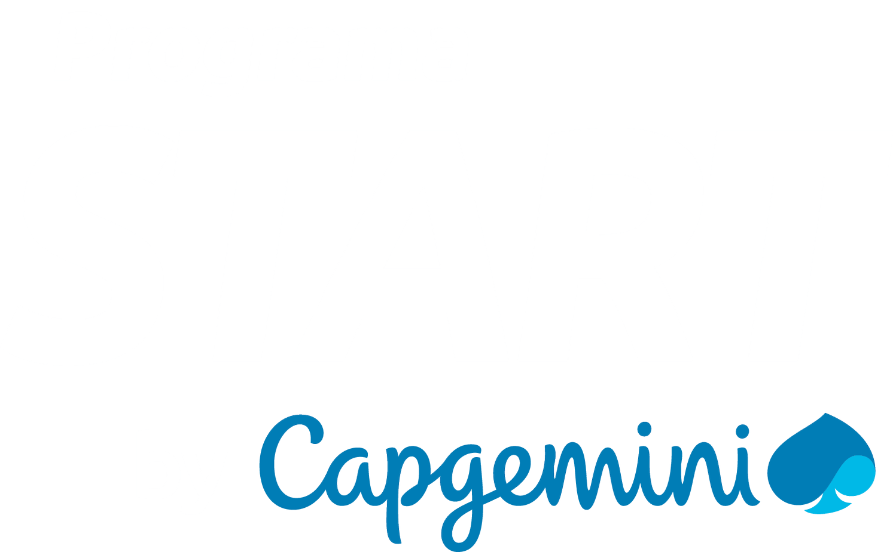

#  Start By Capgemini -Trilha Lógica de Programação e Algoritmos III 

[LISTA DE EXERCÍCIO](https://github.com/algaworks/curso-especialista-spring-rest)

Lista de exercícios oferecido pelo programa Start By Capgemini na Lógica de Programação e Algoritmos III utilizando java  

### Sobre o programa
É uma iniciativa da Capgemini para acelerar a formação de novos talentos em tecnologia, valorizando a inclusão e a diversidade, com cursos online gratuitos que, após finalizados, voce terá a chance de conquistar uma das mais de 500 vagas para trabalhar no time Capgemini!

 

[Mais informações](https://startcapgemini.com.br/)